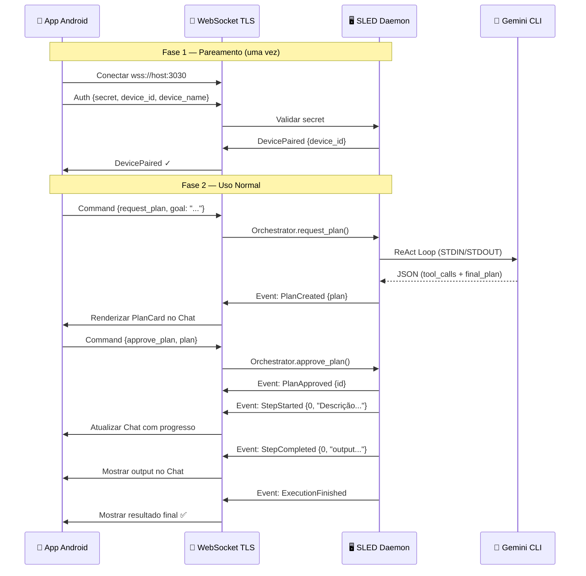

# 📱 Plano Completo — App Android SLED Remote

## Visão Geral

O app Android é o **controle remoto do Daemon**. Ele **não executa nada**. Toda inteligência, planejamento e execução acontecem no PC (Daemon). O app apenas:

- Envia intenções (goals) via WebSocket
- Recebe planos gerados pelo Daemon
- Aprova ou rejeita planos
- Monitora execução em tempo real
- Visualiza logs e histórico

---

## 🏗️ Arquitetura de Comunicação

```
┌─────────────────────────┐          WebSocket TLS (wss://)         ┌──────────────────────┐
│     App Android         │ ◄──────────────────────────────────────►│   SLED Daemon (PC)   │
│                         │              porta 3030                 │                      │
│  ┌───────────────────┐  │                                        │  ┌────────────────┐   │
│  │  Chat Interface   │──┼── goal ──────────────────────────────►│──│  Orchestrator  │   │
│  │  (enviar goals)   │  │                                        │  └───────┬────────┘   │
│  └───────────────────┘  │                                        │          │            │
│                         │                                        │          ▼            │
│  ┌───────────────────┐  │           Event: PlanCreated           │  ┌────────────────┐   │
│  │  Plan Viewer      │◄─┼──────────────────────────────────────◄│──│  Gemini CLI    │   │
│  │  (aprovar/rejeitar)│  │                                       │  └────────────────┘   │
│  └───────────────────┘  │                                        │                       │
│                         │  ── approve_plan ──────────────────►   │  ┌────────────────┐   │
│  ┌───────────────────┐  │                                        │  │  Executor      │   │
│  │  Live Terminal    │◄─┼── Events: StepStarted/Completed ─────◄│──│  (Sandbox)     │   │
│  │  (monitorar)      │  │                                        │  └────────────────┘   │
│  └───────────────────┘  │                                        │                       │
│                         │           Event: ExecutionFinished      │  ┌────────────────┐   │
│  ┌───────────────────┐  │◄─────────────────────────────────────◄│──│  Event Bus     │   │
│  │  Histórico        │  │                                        │  └────────────────┘   │
│  └───────────────────┘  │                                        │                       │
└─────────────────────────┘                                        └──────────────────────┘
```

---

## 🔌 Protocolo de Comunicação (WebSocket JSON)

O Daemon já tem o WebSocket TLS rodando em `0.0.0.0:3030`. Atualmente ele:
- **Envia** todos os eventos do `EventBus` para clientes WebSocket conectados
- **Recebe** mensagens JSON e publica no `EventBus`

### Formato das Mensagens (App → Daemon)

Precisamos definir um protocolo de mensagens claro. Estas são as mensagens que o app vai enviar:

```json
// 1. Autenticação (primeira mensagem após conectar)
{
  "type": "Auth",
  "payload": {
    "token": "secret-do-pareamento",
    "device_id": "uuid-do-dispositivo",
    "device_name": "Galaxy S24 de Izael"
  }
}

// 2. Solicitar um plano (enviar goal)
{
  "type": "Command",
  "payload": {
    "name": "request_plan",
    "args": {
      "goal": "Crie um arquivo hello.txt na pasta Downloads"
    }
  }
}

// 3. Aprovar um plano
{
  "type": "Command",
  "payload": {
    "name": "approve_plan",
    "args": {
      "plan_id": "uuid-do-plano",
      "plan": { ... }  // Plan struct completa
    }
  }
}

// 4. Rejeitar um plano
{
  "type": "Command",
  "payload": {
    "name": "reject_plan",
    "args": {
      "plan_id": "uuid-do-plano"
    }
  }
}

// 5. Pausar execução
{
  "type": "Command",
  "payload": {
    "name": "pause_execution",
    "args": {}
  }
}

// 6. Solicitar histórico de logs
{
  "type": "Command",
  "payload": {
    "name": "get_logs",
    "args": {}
  }
}

// 7. Solicitar status atual
{
  "type": "Command",
  "payload": {
    "name": "get_status",
    "args": {}
  }
}
```

### Formato das Mensagens (Daemon → App)

O Daemon já envia eventos serializados. O app vai receber:

```json
// Eventos (já existentes e serializados automaticamente)
{"DaemonStarted": null}

{"PlanCreated": {"id": "uuid", "goal": "...", "steps": [...], "risk_level": "low"}}

{"PlanApproved": {"id": "uuid"}}

{"StepStarted": {"step_index": 0, "description": "Criar arquivo..."}}

{"StepCompleted": {"step_index": 0, "output": "Arquivo criado com sucesso..."}}

{"StepFailed": {"step_index": 0, "error": "Permission denied"}}

{"RecoverySuggested": {"id": "uuid", "alternative_plan": {...}}}

{"ExecutionFinished": null}

{"ExecutionAborted": {"reason": "Max attempts reached"}}

// Respostas a Commands (NOVO — precisamos implementar no Daemon)
{"type": "Response", "payload": {
  "command": "get_logs",
  "data": [{"id": "...", "goal": "...", "status": "Concluído", ...}]
}}

{"type": "Response", "payload": {
  "command": "get_status",
  "data": {"status": "active", "websocket": "listening", "device_count": 1}
}}
```

---

## 🔐 Fluxo de Pareamento (Segurança)

```
1. Usuário abre aba "Segurança" no Desktop (Tauri)
2. Desktop mostra QR Code com payload: sled://192.168.1.100:3030?secret=uuid-secreto
3. App escaneia QR Code
4. App extrai: host, port, secret
5. App conecta em wss://192.168.1.100:3030
6. App envia mensagem Auth com o secret
7. Daemon valida o secret
8. Daemon registra o device no SQLite
9. Daemon emite evento DevicePaired
10. App recebe confirmação e salva o token localmente (SharedPreferences)
11. Conexões futuras: App reconecta usando device_id + token salvo
```

> [!IMPORTANT]
> O certificado TLS é auto-assinado (gerado pelo `rcgen` no bootstrap). O app Android vai precisar ter um `TrustManager` customizado que aceite o cert do Daemon, ou o Daemon precisa exportar o fingerprint do cert no QR code para o app validar.

---

## 📱 Estrutura do App Android (Android Studio / Kotlin)

### Estrutura de Pastas

```
app/
├── src/main/java/com/izael/sled/
│   │
│   ├── MainActivity.kt                    # Entry point, Navigation Host
│   │
│   ├── data/
│   │   ├── websocket/
│   │   │   ├── SledWebSocketClient.kt     # OkHttp WebSocket client (TLS)
│   │   │   ├── MessageSerializer.kt       # JSON ↔ Kotlin data classes
│   │   │   └── ConnectionManager.kt       # Reconexão automática, heartbeat
│   │   │
│   │   ├── models/
│   │   │   ├── Plan.kt                    # data class Plan (espelho do Rust)
│   │   │   ├── Step.kt                    # data class Step
│   │   │   ├── Event.kt                   # sealed class DaemonEvent
│   │   │   ├── WsMessage.kt              # sealed class p/ mensagens WS
│   │   │   └── Execution.kt              # Histórico de execuções
│   │   │
│   │   ├── repository/
│   │   │   ├── DaemonRepository.kt        # Camada de abstração (envia Commands, recebe Events)
│   │   │   └── PairingRepository.kt       # Lógica de pareamento e persistência
│   │   │
│   │   └── local/
│   │       └── SledPreferences.kt         # SharedPreferences (token, host, port)
│   │
│   ├── ui/
│   │   ├── theme/
│   │   │   ├── Color.kt                   # Paleta escura (igual ao Desktop)
│   │   │   ├── Theme.kt                   # Material3 Dark Theme
│   │   │   └── Typography.kt             # JetBrains Mono + Inter
│   │   │
│   │   ├── screens/
│   │   │   ├── ChatScreen.kt             # 🟣 TELA PRINCIPAL — Chat com o Daemon
│   │   │   ├── PlanReviewScreen.kt        # Modal de aprovação de plano
│   │   │   ├── HistoryScreen.kt           # Lista de execuções passadas
│   │   │   ├── PairingScreen.kt           # Scanner QR Code
│   │   │   └── SettingsScreen.kt          # Configurações de conexão
│   │   │
│   │   ├── components/
│   │   │   ├── ChatBubble.kt             # Bolha de mensagem (user / daemon)
│   │   │   ├── PlanCard.kt               # Card visual do plano com steps
│   │   │   ├── StepProgressItem.kt        # Item de step com status (✓/✗/⏳)
│   │   │   ├── LiveTerminalView.kt        # Terminal ao vivo (output de steps)
│   │   │   ├── ConnectionBadge.kt         # Badge de status de conexão
│   │   │   └── RiskBadge.kt              # Badge de risco (Low/Medium/High)
│   │   │
│   │   └── viewmodels/
│   │       ├── ChatViewModel.kt           # Estado do chat + comandos WS
│   │       ├── PlanViewModel.kt           # Estado do plano pendente
│   │       └── ConnectionViewModel.kt     # Estado da conexão WS
│   │
│   └── service/
│       └── SledNotificationService.kt     # Notificações push quando plano chega
│
├── src/main/res/
│   ├── values/colors.xml                  # Cores do tema SLED
│   └── ...
│
└── build.gradle.kts                       # Dependências
```

### Dependências Recomendadas (build.gradle.kts)

```kotlin
dependencies {
    // WebSocket
    implementation("com.squareup.okhttp3:okhttp:4.12.0")
    
    // JSON
    implementation("com.google.code.gson:gson:2.11.0")
    // ou kotlinx.serialization:
    implementation("org.jetbrains.kotlinx:kotlinx-serialization-json:1.6.3")
    
    // QR Code Scanner
    implementation("com.google.mlkit:barcode-scanning:17.3.0")
    implementation("androidx.camera:camera-camera2:1.4.1")
    implementation("androidx.camera:camera-lifecycle:1.4.1")
    implementation("androidx.camera:camera-view:1.4.1")
    
    // UI
    implementation("androidx.compose.material3:material3:1.3.1")
    implementation("androidx.navigation:navigation-compose:2.8.5")
    implementation("androidx.lifecycle:lifecycle-viewmodel-compose:2.8.7")
    
    // Notificações
    implementation("androidx.core:core-ktx:1.15.0")
}
```

---

## 🟣 Tela Principal — Chat Screen (Detalhada)

A experiência é um **chat com o Daemon**, como se fosse um assistente:

```
┌─────────────────────────────────┐
│  🟢 SLED Daemon  ·  Conectado  │  ← Header com status
├─────────────────────────────────┤
│                                 │
│  ┌────────────────────────┐     │
│  │ 🤖 Daemon              │     │  ← Mensagem do sistema
│  │ Pronto para comandos.  │     │
│  └────────────────────────┘     │
│                                 │
│     ┌────────────────────────┐  │
│     │ 👤 Você               │  │  ← Mensagem do usuário
│     │ Liste os 5 maiores    │  │
│     │ arquivos na Downloads │  │
│     └────────────────────────┘  │
│                                 │
│  ┌────────────────────────┐     │
│  │ 🤖 Daemon              │     │
│  │ ⏳ Pensando...          │     │  ← Feedback de loading
│  └────────────────────────┘     │
│                                 │
│  ┌────────────────────────────┐ │
│  │ 📋 PLANO GERADO           │ │  ← Card de plano
│  │ Meta: Listar 5 maiores     │ │
│  │ Risco: 🟢 Baixo            │ │
│  │                             │ │
│  │ 1. ⏳ Executar PowerShell  │ │  ← Steps numerados
│  │    Get-ChildItem ...       │ │
│  │                             │ │
│  │ ┌─────────┐ ┌────────────┐ │ │
│  │ │ Aprovar  │ │  Rejeitar  │ │ │  ← Botões de ação
│  │ │   ✓     │ │     ✗      │ │ │
│  │ └─────────┘ └────────────┘ │ │
│  └────────────────────────────┘ │
│                                 │
│  ┌────────────────────────┐     │
│  │ 🤖 Daemon              │     │
│  │ ✅ Plano executado com  │     │  ← Resultado
│  │ sucesso!                │     │
│  │ ┌──────────────────┐   │     │
│  │ │ 📄 resultado.txt  │   │     │  ← Output expandível
│  │ │ Arquivo1  450 MB  │   │     │
│  │ │ Arquivo2  230 MB  │   │     │
│  │ │ ...               │   │     │
│  │ └──────────────────┘   │     │
│  └────────────────────────┘     │
│                                 │
├─────────────────────────────────┤
│ ┌─────────────────────────┐ 📎 │
│ │ Digite sua intenção...  │ ➤  │  ← Input de mensagem
│ └─────────────────────────┘    │
└─────────────────────────────────┘
```

### Fluxo de Mensagens no Chat

| Ação | Mensagem no Chat | Tipo |
|------|------------------|------|
| Usuário digita goal | Bolha azul com o texto | `user_message` |
| Gemini pensando | Bolha cinza com "⏳ Gerando plano..." | `system_loading` |
| Plano gerado | Card expandível com steps e ações | `plan_card` |
| Usuário aprova | Bolha verde "✓ Plano aprovado" | `user_action` |
| Step iniciado | Mini-log "▶ Etapa 1: Descrição..." | `step_progress` |
| Step concluído | Mini-log "✓ Etapa 1 concluída" + output | `step_progress` |
| Step falhou | Mini-log vermelho "✗ Falha: ..." | `step_error` |
| Recovery | Card amarelo "🔄 Plano alternativo sugerido" | `recovery_card` |
| Execução finalizada | Bolha verde com resultado final | `execution_result` |
| Execução abortada | Bolha vermelha com motivo | `execution_error` |

---

## 🔄 Fluxo Completo (End-to-End)



---

## 🔧 O Que Precisa Mudar no Daemon (Backend Rust)

O WebSocket server atual já faz o broadcast de eventos, mas **não processa commands** recebidos do app. Precisamos implementar:

### 1. Processar Commands no WebSocket handler

Atualmente, o `handle_connection` recebe um `Event` via WebSocket e publica direto no bus. Precisamos fazer ele distinguir entre:
- `WsMessage::Auth` → Validar pareamento
- `WsMessage::Command` → Executar comando (request_plan, approve_plan, get_logs, etc.)
- `WsMessage::Event` → Publicar no EventBus (comportamento atual)

### 2. Enviar Responses para o App

Quando o app pede `get_logs` ou `get_status`, o Daemon precisa responder com os dados do banco. Isso exige que o WebSocket handler tenha acesso ao `AppState` (DB, Core).

### 3. Autenticação por Device

O handler WebSocket precisa:
- Verificar o `Auth` message na conexão
- Validar o secret contra o banco
- Rejeitar conexões não autenticadas
- Emitir `DevicePaired` após sucesso

### Estimativa: esses 3 itens tomam ~2-3 horas de implementação Rust.

---

## 📋 Ordem de Implementação Recomendada

### Sprint 1 — Fundação (App Android)
1. Criar projeto no Android Studio (Kotlin + Jetpack Compose)
2. Implementar `SledWebSocketClient.kt` com OkHttp
3. Criar as data classes (Plan, Step, Event, WsMessage)
4. Implementar tela de Pareamento com scanner QR Code
5. Testar conexão WebSocket básica com o Daemon

### Sprint 2 — Chat Core
1. Implementar `ChatScreen.kt` com lista de mensagens
2. Implementar `ChatViewModel.kt` com StateFlow
3. Criar componente `PlanCard.kt` com botões Aprovar/Rejeitar
4. Implementar envio de goals via WebSocket
5. Implementar recepção de `PlanCreated` e renderização no chat

### Sprint 3 — Evolução do Daemon (Rust)
1. Refatorar `handle_connection` para processar `WsMessage` tipado
2. Implementar processamento de Commands (request_plan, approve_plan)
3. Adicionar autenticação WebSocket
4. Implementar envio de Responses (get_logs, get_status)

### Sprint 4 — Monitoramento em Tempo Real
1. Implementar feedback de steps no chat (progress indicators)
2. Criar `LiveTerminalView` para output expandível
3. Implementar notificações push quando plano chega
4. Implementar reconexão automática do WebSocket

### Sprint 5 — Polish
1. Implementar tela de Histórico
2. Implementar tela de Settings (host, port, reconexão)
3. Testes de estresse com múltiplas mensagens
4. Animações e micro-interações no chat

---

## 🎨 Design System (Espelhado do Desktop)

Para manter consistência visual entre Desktop e Mobile:

```kotlin
// Color.kt — Espelhando as CSS vars do Desktop
val BgPrimary = Color(0xFF0a0b0f)
val BgSecondary = Color(0xFF12131a)
val SurfaceLight = Color(0xFF1a1b26)
val TextBright = Color(0xFFe2e8f0)
val TextDim = Color(0xFF64748b)
val BorderSubtle = Color(0x1Affffff)
val StatusSuccess = Color(0xFF10b981)
val StatusError = Color(0xFFef4444)
val StatusInfo = Color(0xFF3b82f6)
val AccentPrimary = Color(0xFF6366f1)  // Indigo
val AccentSecondary = Color(0xFFa855f7) // Purple
```

---

## 📊 Resumo Executivo

| Aspecto | Decisão |
|---------|---------|
| **Plataforma** | Android nativo (Kotlin + Jetpack Compose) |
| **IDE** | Android Studio |
| **Comunicação** | WebSocket TLS (OkHttp) |
| **Protocolo** | JSON tipado (WsMessage sealed class) |
| **Pareamento** | QR Code → secret → Auth handshake |
| **UI principal** | Chat interface (similar a WhatsApp/ChatGPT) |
| **Aprovação** | Cards inline no chat com botões |
| **Monitoramento** | Eventos em tempo real no chat |
| **Persistência local** | SharedPreferences (token, host) |
| **Notificações** | Firebase ou local (quando plano chega) |
| **Mudanças no Daemon** | Processar Commands no WS, Auth, Responses |
